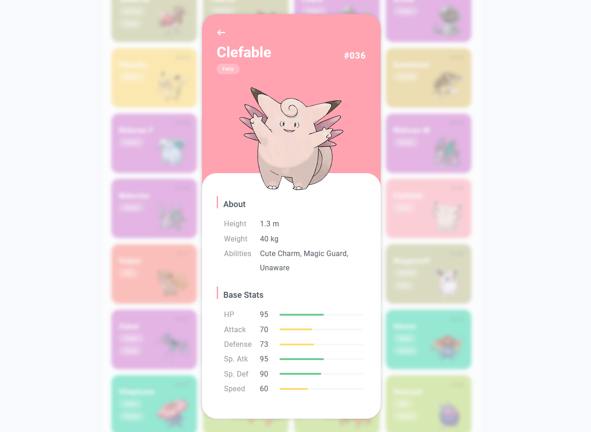

# Pokedex

Projeto desenvolvido durante bootcamp da DIO, com base no [design](https://dribbble.com/shots/6540871-Pokedex-App/) de Saepul Nahwan e dados da [PokeAPI](https://pokeapi.co/). Utilizando HTML, CSS e JavaScript, foi implementado um layout responsivo para visualização em diferentes tamanhos de tela.

